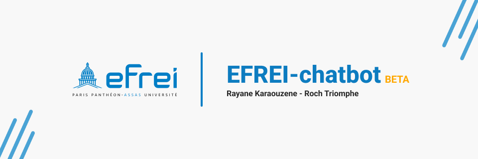

# efrei-simple-chatbot



**:robot: A simple chatbot for an Efrei python project :robot:**

 [](https://github.com/Oneloutre/efrei-simple-chatbot) 


This project is a simple chatbot made in python for an Efrei project. It is based on a simple GUI in the CLI and a simple chatbot engine made by us.

<u>Here is what it can do for now :</u>

- [x] Display the list of the least important words in the corpus of documents.
- [x] Display the word(s) with the highest TF-IDF score.
- [x] Identify the word(s) most frequently repeated by President Chirac.
- [x] Identify the name(s) of the president(s) who have spoken about the "Nation" and the one who has repeated it the most times.
- [x] Identify the first president to discuss climate and/or ecology.
- [x] Excluding words labeled as "non-important," what word(s) have all presidents mentioned.

### Table of contents :bookmark_tabs:

 - [Installation](#installation-wrench)
 - [Usage](#usage-computer)
 - [Authors](#authors-art)
 - [License](#license-page_facing_up)
 - [Project status](#project-status-white_check_mark)


## Installation :wrench:
*don't mind for now, external libraries are not used yet*
```bash
pip install -r requirements.txt
```
You can modify the settings of the chatbot in the `settings.py` file.
But please keep in mind that you can break the system by changing the directory in this file.

## Usage :computer:
```bash
python main.py
```
Then, when the program is launched, you just have to type a number which corresponds to the action you want to do.

## Authors :art:
- Rayane Karaouzene
- Roch Triomphe

## License :page_facing_up:
[GNU GPLv2](https://choosealicense.com/licenses/gpl-2.0/)

## Project status :white_check_mark:
Project running :runner: